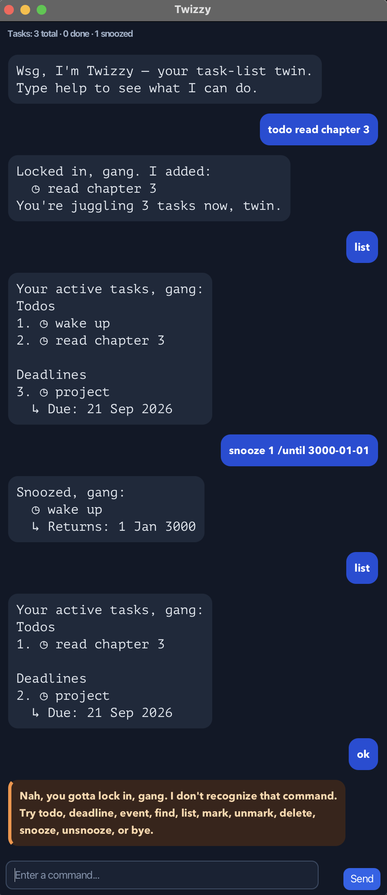

# Twizzy User Guide

Twizzy is your task-list twin: it remembers the boring stuff so you do not have to keep it all in your head.

## Interface



Twizzy uses a dark chat-style interface. Your commands appear in deep-blue bubbles, Twizzy replies appear in blue-grey bubbles, and invalid commands are highlighted in amber. The task summary at the top shows the total, completed, and currently snoozed task counts.

## Command format

- Type one command per line.
- Task numbers come from the latest `list` output, except `unsnooze`, which uses `list snoozed` numbers.
- Dates must use `yyyy-MM-dd`, including leading zeroes.
- Extra spaces around command details are ignored.
- `◷` identifies a pending task and `★` identifies a completed task.

## Show command help

Use `help` to display the supported commands and their required markers. This is the fastest way to check the syntax for deadlines, events, snoozing, and unsnoozing while using the GUI.

## Add a todo

Use `todo <description>` for a task without a date.

```text
todo read chapter 3
```

```text
Locked in, gang. I added:
  ◷ read chapter 3
You're juggling 1 task now, twin.
```

## Add a deadline

Use `deadline <description> /by <yyyy-MM-dd>`.

```text
deadline submit report /by 2026-09-18
```

```text
Locked in, gang. I added:
  ◷ submit report
  ↳ Due: 18 Sep 2026
You're juggling 2 tasks now, twin.
```

## Add an event

Use `event <description> /from <yyyy-MM-dd> /to <yyyy-MM-dd>`.

```text
event hackathon /from 2026-09-21 /to 2026-09-22
```

```text
Locked in, gang. I added:
  ◷ hackathon
  ↳ Schedule: 21 Sep 2026 → 22 Sep 2026
You're juggling 3 tasks now, twin.
```

## List tasks

Use `list` to see the current task numbers and statuses.

```text
Your active tasks, gang:
Todos
1. ◷ read chapter 3

Deadlines
2. ◷ submit report
  ↳ Due: 18 Sep 2026

Events
3. ◷ hackathon
  ↳ Schedule: 21 Sep 2026 → 22 Sep 2026
```

`◷` means pending and `★` means completed. Tasks are grouped under Todos, Deadlines, and Events to make the list easier to scan. The displayed order is always Todos first, then Deadlines, then Events; use those current numbers with `mark`, `unmark`, `delete`, and `snooze`.

## Find tasks

Use `find <keyword>` to search active task descriptions without worrying about letter case. Matching tasks keep the same grouped order used by `list`.

```text
find report
```

```text
Here are the matching tasks in your list:
Deadlines
1. ◷ submit report
  ↳ Due: 18 Sep 2026
```

If nothing matches, Twizzy says `No tasks matched that, twin. Try another keyword.`

## Mark or unmark a task

Use `mark <number>` when a task is done:

```text
mark 2
```

```text
Marked done, twin:
  ★ submit report
  ↳ Due: 18 Sep 2026
```

Use `unmark <number>` if the task returns for a sequel:

```text
unmark 2
```

```text
Marked pending, gang:
  ◷ submit report
  ↳ Due: 18 Sep 2026
```

## Snooze a task

Use `snooze <number> /until <yyyy-MM-dd>` to postpone an active task until a future date. Snoozed tasks are hidden from normal `list` and `find` results until that date, so remaining active task numbers stay usable with `mark`, `unmark`, and `delete`.

```text
snooze 2 /until 2099-12-31
```

```text
Snoozed, gang:
  ◷ submit report
  ↳ Due: 18 Sep 2026
  ↳ Returns: 31 Dec 2099
```

Use `list snoozed` to inspect deferred tasks and their return dates.

```text
Here are the snoozed tasks:
Deadlines
1. ◷ submit report
  ↳ Due: 18 Sep 2026
  ↳ Returns: 31 Dec 2099
```

## Unsnooze a task

Use `unsnooze <number>` to return a task immediately. The number comes from the latest `list snoozed` output, not the normal active `list`.

```text
unsnooze 1
```

```text
Unsnoozed, twin:
  ◷ submit report
  ↳ Due: 18 Sep 2026
```

## Delete a task

Use `delete <number>` to remove a task. Remaining tasks are renumbered automatically.

```text
delete 1
```

```text
Deleted, broski:
  ◷ read chapter 3
You're juggling 2 tasks now, twin.
```

## Exit

Use `bye` to close Twizzy safely.

```text
Catch you later, broski. Don't ghost your tasks.
```

## Saved data

Twizzy saves after every successful add, mark, unmark, delete, snooze, or unsnooze command. On startup, it loads tasks from `data/twizzy.txt`, relative to the folder from which you run Twizzy. If the directory or file does not exist, Twizzy starts with an empty list and creates them on the first save. Existing data files remain compatible when snooze information is added.

Before replacing saved data, Twizzy writes the full replacement to a temporary file in the same local `data/` folder. It then replaces `twizzy.txt`, reducing the risk of a partial file if the app stops during a save. Twizzy does not create task files outside the folder from which it runs, including your home folder.

If Twizzy cannot read a saved-data file, both the GUI and console show an error and lock task-changing commands so the file cannot be overwritten accidentally. Invalid saved entries such as blank descriptions or events that end on/before their start date are treated as corrupt data.

## Invalid input

Twizzy rejects incomplete commands, unknown commands, invalid task numbers, impossible dates, event end dates that are not after their start dates, snooze dates that are not in the future, and an `unsnooze` command when no tasks are snoozed. It also explains when a task is already marked done or pending, and rejects duplicate pending tasks without changing the task list. For a duplicate, use `list` to find the existing task, or complete it before adding it again. You can add a completed task again if it becomes relevant in the future.

```text
deadline time travel /by 2025-02-29
```

```text
Nah, you gotta lock in, gang. The deadline date must be a valid date in yyyy-MM-dd format.
```
